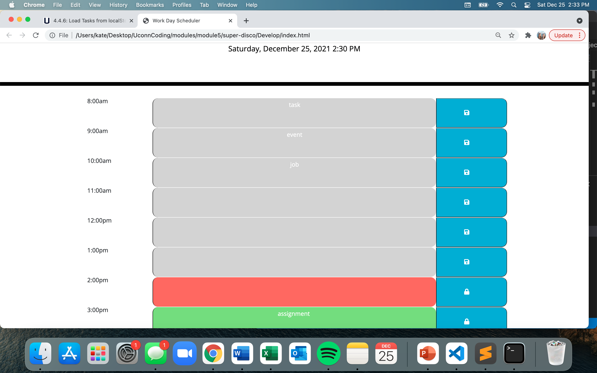

# Work Day Scheduler Starter Code
 

 ## Project Aims 
 * Create a daily planner that shows each hour of the day.
 * the active hour is colored red, the hours that have passed are colored grey, and the hours that have not yet happened are colored green. 
 * When a time block is clicked, the user can enter and save an event for that time
 * The event is saved in local storage so that when the page refreshes, the saved event is still present. 

 ## Strategies Used 
 * HTML/CSS/JavaScript/JQuery
 * local storage 
 

 <a href="https://kspitalnic.github.io/workDayScheduler/">Link to Website </a>
 
<a href="https://github.com/kspitalnic/workDayScheduler">Link to Repository </a>

Screenshot:  
